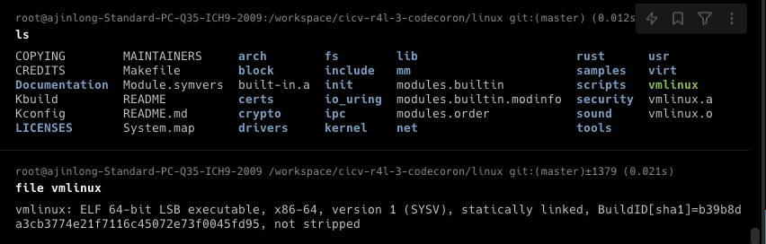
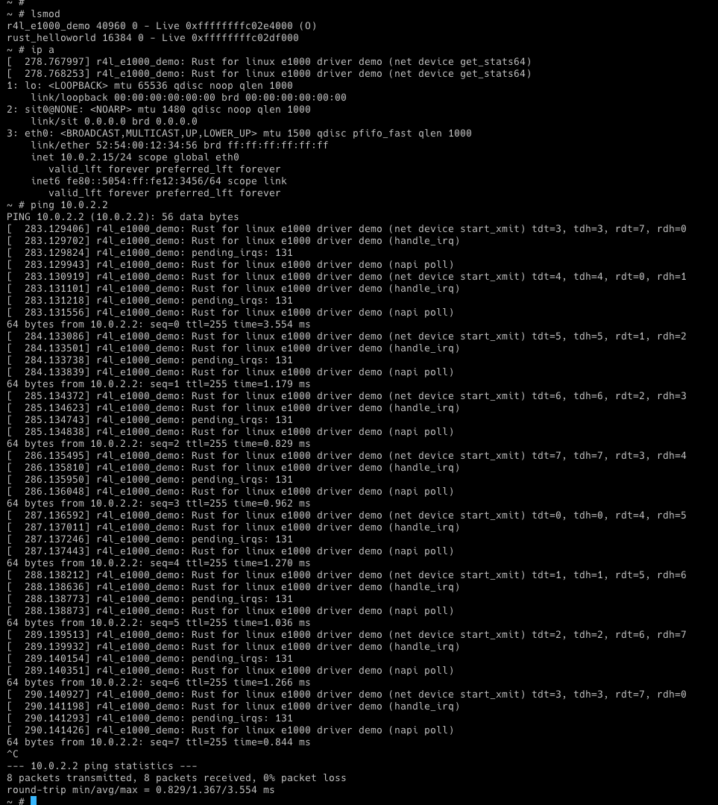
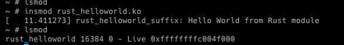
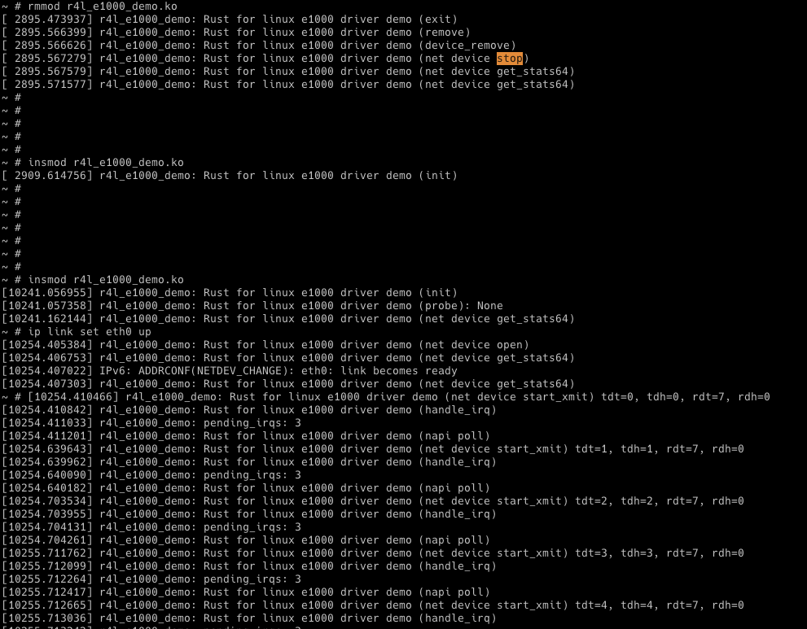
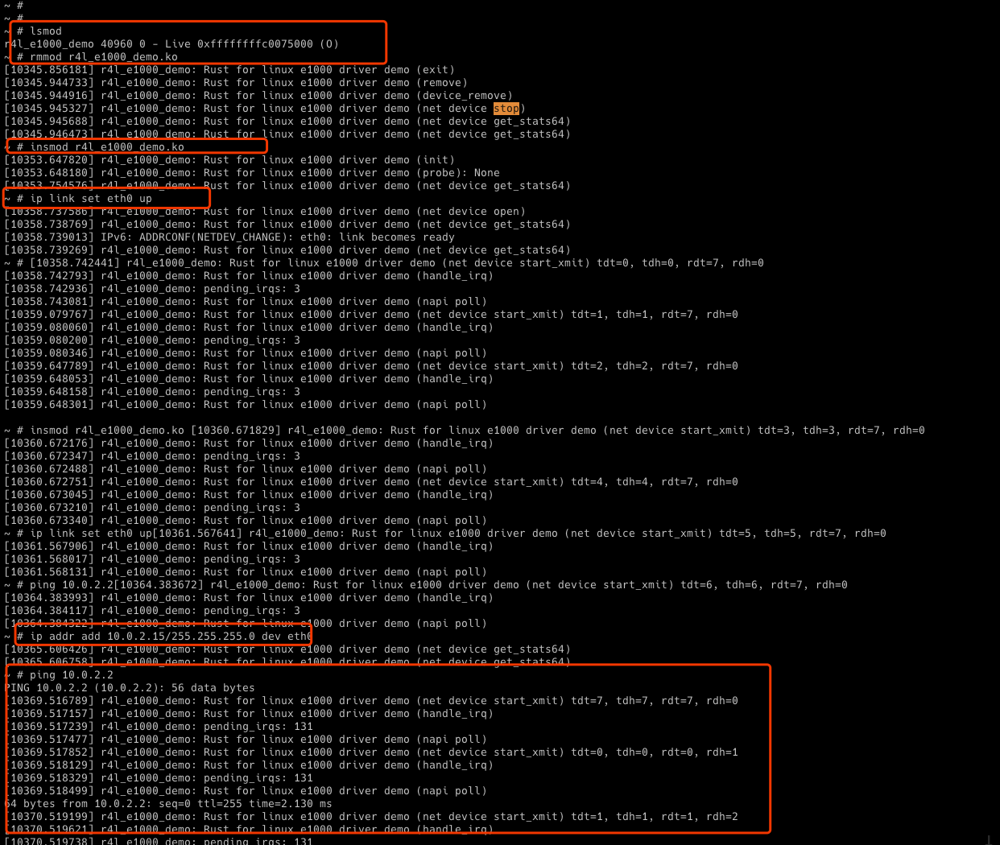
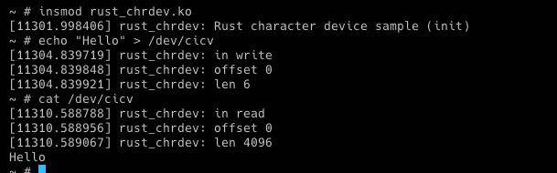
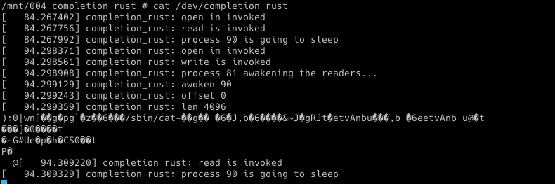
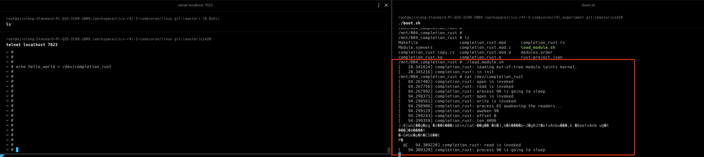

# Rust for Linux训练营作业

## 作业1：编译Linux内核

目标

1.编译内核，生成vmlinx镜像文件

- vmlinux是kernel镜像文件，没有经过压缩，包含很多符号信息，一般用于调试，不能用于os启动引导
- bzimage是经过压缩的kernel镜像文件，不包含符号信息，可以用于引导



## 作业2：对Linux内核进行一些配置

目标

1. 禁用原生e1000网卡驱动成功，加载r4l_e1000_demo.ko 成功

问题：

1. 编译成内核模块，是在哪个文件中以哪条语句定义的？
2. 该模块位于独立的文件夹内，却能编译成Linux内核模块，这叫做out-of-tree module，请分析它是如何与内核代码产生联系的？

回答

1、本质上还是src_e1000/Makefile进行编译的
```makefile
KDIR ?= ../linux

default:
	$(MAKE) -C $(KDIR) M=$$PWD
```

2、如何与内核代码产生联系，也是通过Makefile中的KDIR，定义了kernel source tree的目录，这样在编译自定义的模块时，就可以与kernel结合。



## 作业3：使用rust编写一个简单的内核模块并运行

目标

1. 使用rust编写一个简单的内核模块并运行 成功

问题

1、Kconfig中定义了menu的option，当我们运行 make LLVM=1 menuconfig 时，看到的选项就来自Kconfig文件。
```makefile
config SAMPLE_RUST_HELLOWORLD
        tristate "print hello world"
        help
                this option builds the hello world ko for Rust
                if unsure, say N.
```
Kconfig的tristate 代表选项有三种选择。
- <M> module 编译成一个module，可以支持动态加载和移除
- <> module 是exclued。不进行编译
- <*> 代表直接编译到内核镜像中，不能手动加载和移除

2、Kconfig代表一个开关，供用户选择是否编译指定模块。真正进行编译的是Makefile文件
```Makefile
obj-$(CONFIG_SAMPLE_RUST_HELLOWORLD)            += rust_helloworld.o
```

- . 这里会首先检查变量CONFIG_SAMPLE_RUST_HELLOWORLD 是否为True。这里取决于Kconfig中的SAMPLE_RUST_HELLOWORLD变量。
- . 如果为True，则将rust_helloworld.o 编译成rust_helloworld.ko。如果没有rust_helloworld.o，则寻找对应的源文件rust_helloworld.rs进行





## 作业4：为e1000网卡驱动添加remove代码


目标

1. 需要参照作业2的配置方法，运行build_image.sh脚本之后，进入Linux环境下，随后按照作业2的方法进行配置并ping通。 -- 完成


解题思路

1. 先分析r4l_e1000_demo的驱动加载和卸载流程，具体到哪个函数。demo中在函数中都打印了log，比较容易确认。
2. 根据insmod的流程，查看注册了哪些资源。然后在rmmod的流程，释放对应的资源。---- **应该自底向上释放**


insmod 打印的log
> 注意要执行`ip link eth0 up`
```shell
r4l_e1000_demo: Rust for linux e1000 driver demo (init)
r4l_e1000_demo: Rust for linux e1000 driver demo (probe): None
Rust for linux e1000 driver demo (net device get_stats64)
Rust for linux e1000 driver demo (net device open)
```


rmmod 打印的log
```shell
r4l_e1000_demo: Rust for linux e1000 driver demo (exit)
r4l_e1000_demo: Rust for linux e1000 driver demo (remove)
r4l_e1000_demo: Rust for linux e1000 driver demo (device_remove)
r4l_e1000_demo: Rust for linux e1000 driver demo (net device stop)
r4l_e1000_demo: Rust for linux e1000 driver demo (net device get_stats64)
```

那基本上的资源释放流程比较清晰了`net device stop` -> `device_remove` -> `remove` -> `exit`


> 另外可以参考一下c语言版本是如何卸载e1000驱动的
> https://github.com/cicvedu/cicv-r4l-3-codecoron/blob/afaa804d64f8c3aa51974a4371060bdeb7a255cd/linux/drivers/net/ethernet/intel/e1000/e1000_main.c#L1258
1. `e1000_down_and_stop(adapter);e1000_release_manageability(adapter);` --- 关闭和释放adapter
2. `unregister_netdev(netdev);` --- 回收 netdev注册的资源
3. `e1000_phy_hw_reset(hw);` --- 重置寄存器
4. 	`kfree(adapter->tx_ring);
	kfree(adapter->rx_ring);` 释放收发队列的内存
5. `iounmap(hw->hw_addr);`  --- 回收io port资源
6. `pci_release_selected_regions(pdev, adapter->bars);` --- 回收bar空间
7. `free_netdev(netdev);` --- 释放netdev
8. `pci_disable_device(pdev);` --- 关闭pci设备


`net device stop`


> r4l_e1000_demo open() 注册E1000InterruptHandler
```rs
let req_reg = kernel::irq::Registration::<E1000InterruptHandler>::try_new(data.irq, irq_prv_data, kernel::irq::flags::SHARED, fmt!("{}",data.dev.name()))?;

// the caller should properly destroy T and release the memory
/*
let x = Box::new(String::from("Hello"));
let ptr = Box::into_raw(x);
let x = unsafe { Box::from_raw(ptr) };
    */
data._irq_handler.store(Box::into_raw(Box::try_new(req_reg)?), core::sync::atomic::Ordering::Relaxed);
```

> 主要就是释放`NetDevicePrvData` 资源。一般是一些带有off stop disable的函数调用

1. tx_ring和rx_ring的清理
2. irq_handler清理---- irq_handler用Box::into_raw() 生成一段裸指针的内存区域。----根据该方法的官方提示，需要手动进行内存回收
3. `dev: &net::Device` 的清理


`device_remove` 释放
> struct E1000DrvPrvData 实现上没有注册资源。所以device_remove 也没有啥资源释放


`remove` 释放
> 这里对主要对struct E1000DrvPrvData的`pci_dev_ptr: *mut bindings::pci_dev`进行释放，主要就是释放bar空间


`exit` 释放
> 前面的释放完成后，本质上对E1000KernelMod就已经释放完成了







## 作业5：注册字符设备

目标

1. 往Linux系统中注册一个字符设备驱动，使得 /dev/cicv 可以完成基本的读写操作。


Q：作业5中的字符设备/dev/cicv是怎么创建的？它的设备号是多少？它是如何与我们写的字符设备驱动关联上的？

`build_image.sh`中创建了字符设备`/dev/cicv`，其中主设备号major是248,次设备号minor是0。字符设备和设备驱动正是通过major和minor关联的。
```shell
echo "mknod /dev/cicv c 248 0" >> etc/init.d/rcS
```

其中，字符设备驱动的major是通过FFI调用`bindings::alloc_chrdev_region()`来完成major动态分配。至于为啥是248，因为可以自定义的chardev的major是从254往前分配， 其中254到249都被占用了。此次的demo中又没有其它的设备，所以就可以写死在shell脚本中，创建了`/dev/cicv 248 0`。

驱动的minor是在创建Registration时指定，从0开始。
```rs
let mut chrdev_reg = chrdev::Registration::new_pinned(name, 0, module)?;
```

```shell
~ # cat /proc/devices
Character devices:
  1 mem
  4 /dev/vc/0
  4 tty
  4 ttyS
  5 /dev/tty
  5 /dev/console
  5 /dev/ptmx
  7 vcs
 10 misc
 13 input
 21 sg
116 alsa
128 ptm
136 pts
180 usb
189 usb_device
202 cpu/msr
203 cpu/cpuid
226 drm
248 rust_chrdev
249 hidraw
250 usbmon
251 bsg
252 ptp
253 pps
254 rtc
```


对于完成这个实验的困难点是，不知道上层应用如何调用driver的read和write。那就只能根据函数的入参，返回值去完成。

特别注意
1. 其中iobuffer提供了读写buff的方法，可以方便iobuffer和globalmem_buf的数据读写

```rs
systemcall write -> driver write(kernel::io_buffer::IoBufferReader) -> globalmem_buf // 其中IoBufferReader存放从用户空间拷贝的内容
globalmem_buf -> driver read(ernel::io_buffer::IoBufferWriter) -> systemcall read // 将数据存放到IoBufferWriter，可以将数据从内核空间拷贝到用户空间
```





## 项目小试验 

目标

1. 使用completion锁，完成读写的同步。先写后读。

思路

1. 基于作业5 rustchar，加入completion结构体，将completion作为全局的锁
2. init中初始化completion,通过FFI初始化
3. read和write中，先持有completion





